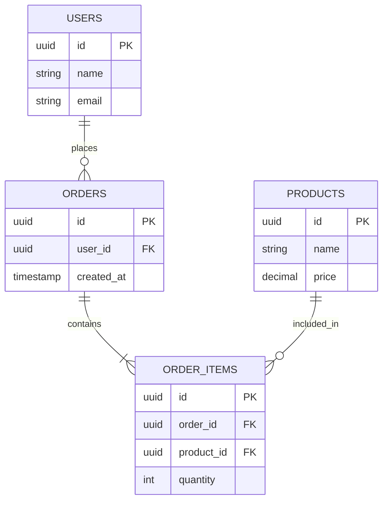

# ER Diagram - 高層次 vs 詳細範例對照

本文件說明 Cloud Architect 與 DBA Agent 在資料模型定義上的職責邊界。

---

## 範例對照

### ✅ Architect 產出（高層次）- ER_DIAGRAM.md



---

### ❌ 不產出（交給 DBA Agent）- schema.sql

```sql
-- Architect 不需要產出以下內容：

CREATE TABLE users (
    id UUID PRIMARY KEY DEFAULT gen_random_uuid(),
    name VARCHAR(100) NOT NULL,
    email VARCHAR(255) NOT NULL UNIQUE,
    password_hash VARCHAR(255) NOT NULL,
    created_at TIMESTAMP WITH TIME ZONE DEFAULT CURRENT_TIMESTAMP,
    updated_at TIMESTAMP WITH TIME ZONE DEFAULT CURRENT_TIMESTAMP,
    deleted_at TIMESTAMP WITH TIME ZONE,

    -- Constraints
    CONSTRAINT email_format CHECK (email ~* '^[A-Za-z0-9._%+-]+@[A-Za-z0-9.-]+\.[A-Za-z]{2,}$'),
    CONSTRAINT name_not_empty CHECK (LENGTH(TRIM(name)) > 0)
);

-- Indexes for performance optimization
CREATE INDEX idx_users_email ON users(email) WHERE deleted_at IS NULL;
CREATE INDEX idx_users_created_at ON users(created_at DESC);
CREATE INDEX idx_users_deleted_at ON users(deleted_at) WHERE deleted_at IS NOT NULL;

-- Trigger for updated_at
CREATE TRIGGER update_users_updated_at
    BEFORE UPDATE ON users
    FOR EACH ROW
    EXECUTE FUNCTION update_updated_at_column();

CREATE TABLE orders (
    id UUID PRIMARY KEY DEFAULT gen_random_uuid(),
    user_id UUID NOT NULL REFERENCES users(id) ON DELETE CASCADE,
    total_amount DECIMAL(12, 2) NOT NULL DEFAULT 0.00,
    status VARCHAR(50) NOT NULL DEFAULT 'pending',
    created_at TIMESTAMP WITH TIME ZONE DEFAULT CURRENT_TIMESTAMP,
    updated_at TIMESTAMP WITH TIME ZONE DEFAULT CURRENT_TIMESTAMP,

    -- Constraints
    CONSTRAINT total_amount_positive CHECK (total_amount >= 0),
    CONSTRAINT valid_status CHECK (status IN ('pending', 'paid', 'shipped', 'completed', 'cancelled'))
);

-- Indexes
CREATE INDEX idx_orders_user_id ON orders(user_id);
CREATE INDEX idx_orders_status ON orders(status) WHERE status != 'completed';
CREATE INDEX idx_orders_created_at ON orders(created_at DESC);

-- Partition by created_at (monthly partitions for large datasets)
CREATE TABLE orders_2024_01 PARTITION OF orders
    FOR VALUES FROM ('2024-01-01') TO ('2024-02-01');
```

---

## 職責邊界清楚定義

| 項目 | Architect（高層次） | DBA Agent（詳細） |
|------|-------------------|-----------------|
| **實體定義** | ✅ 實體名稱 | ✅ 完整 CREATE TABLE |
| **欄位定義** | ✅ 主要欄位名稱（id, name, email） | ✅ 詳細型別（VARCHAR(100), UUID） |
| **關聯關係** | ✅ Mermaid 關聯線（1-1, 1-N, N-N） | ✅ FOREIGN KEY 定義 + ON DELETE/UPDATE |
| **主鍵/外鍵** | ✅ 標註 PK, FK | ✅ PRIMARY KEY, UNIQUE 約束 |
| **索引** | ❌ 不定義 | ✅ CREATE INDEX（效能優化） |
| **約束條件** | ❌ 不定義 | ✅ CHECK, NOT NULL, DEFAULT |
| **觸發器/函數** | ❌ 不定義 | ✅ Triggers, Stored Procedures |
| **分區策略** | ❌ 不定義 | ✅ Partitioning（大資料量優化） |
| **Migration 腳本** | ❌ 不產出 | ✅ Alembic/Flyway/Liquibase 腳本 |

---

## 最低交付要求

### Architect 的 ER_DIAGRAM.md 必須包含：

- **[ ]** 所有實體名稱（大寫，例如 USERS, ORDERS）
- **[ ]** 實體之間的關聯關係（使用 Mermaid erDiagram 格式）
- **[ ]** 每個實體的主要欄位（id, 業務關鍵欄位）
- **[ ]** 標註主鍵（PK）和外鍵（FK）
- **[ ]** 標註關聯類型（1-1 / 1-N / N-N）
- **[ ]** 包含基本資料型別（string, int, uuid, timestamp, decimal）

### Architect 不需要做（由 DBA Agent 負責）：

- ❌ 詳細欄位型別（VARCHAR(100), DECIMAL(12,2), TIMESTAMP WITH TIME ZONE）
- ❌ 約束條件（NOT NULL, UNIQUE, CHECK, DEFAULT）
- ❌ 索引設計（CREATE INDEX, 複合索引）
- ❌ 觸發器與函數（Triggers, Stored Procedures）
- ❌ 分區策略（Partitioning）
- ❌ 效能優化（Query Optimization, EXPLAIN ANALYZE）
- ❌ Migration 腳本（Alembic/Flyway）

---

## 輸出要求總結

```
REQUIRED OUTPUT from STEP 4:
- 資料模型複雜度：High/Medium/Low
- 建議開發順序與理由
- 首要調用的 Agent 名稱（API Designer 或 API Designer + DBA）
- 高層次 ER Diagram（Mermaid 格式，產出至 ER_DIAGRAM.md，符合上述最低要求）
```
