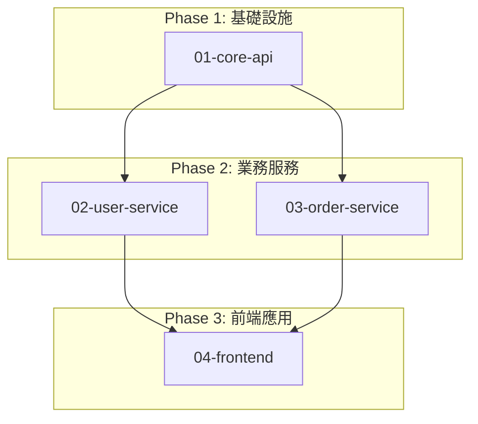

# Project Splitting Logic

## STEP 1.5: 專案複雜度評估與切分決策

### 複雜度評估指標

```
EVALUATE PROJECT COMPLEXITY:

計算複雜度指標：
- 功能模組數量: [count]
- 微服務/主要元件數量: [count]
- 資料實體數量: [count]
- 外部整合數量: [count]
- 預估設計時間: [minutes]
```

### 切分決策邏輯

```
IF (符合以下任一條件):
  - 功能模組 > 3 個
  - 微服務數量 > 2 個
  - 資料實體 > 7 個
  - 外部整合 > 2 個
  - 預估設計時間 > 60 分鐘
  - 跨多個業務領域（如：電商 + 物流 + 金流）
THEN:
  決策: 執行專案切分流程 → 進入 STEP 1.6

  OUTPUT MESSAGE:
  "⚠️ 專案複雜度評估：HIGH
  - [列出觸發條件]
  - 預估完整設計時間：[X] 分鐘

  建議策略：將專案切分為多個子專案，逐步完成架構設計

  接下來將執行 STEP 1.6 進行專案切分..."

ELSE:
  決策: 繼續完整架構設計流程 → 跳過 STEP 1.6，直接進入 STEP 2

  OUTPUT MESSAGE:
  "✅ 專案複雜度評估：MEDIUM/LOW
  - 預估設計時間：[X] 分鐘
  - 適合一次性完成架構設計

  繼續執行 STEP 2..."
ENDIF
```

## STEP 1.6: 專案切分與規劃

### 切分策略選擇

**策略 A - 按業務領域切分:**
- **適用**: 多業務領域專案（如：電商 = 商品 + 訂單 + 支付）
- **優點**: 團隊可並行開發、領域邊界清晰
- **範例**: user-domain, product-domain, order-domain

**策略 B - 按技術層次切分:**
- **適用**: 分層架構專案（如：前端 + API + 資料庫）
- **優點**: 技術專業化、介面契約明確
- **範例**: frontend-layer, backend-api, database-layer

**策略 C - 按開發優先級切分:**
- **適用**: MVP + 進階功能專案
- **優點**: 快速交付核心功能、漸進式擴展
- **範例**: mvp-core, advanced-analytics, third-party-integrations

**策略 D - 混合策略:**
- **適用**: 複雜大型專案
- **範例**: Phase1-core-api, Phase2-user-service, Phase2-order-service, Phase3-frontend

### 執行步驟

**1. 建立專案切分目錄結構（MUST execute）:**

```
.claude/planning/[project-name]/
├── PROJECT_SPLIT.md          # 切分規劃總覽（使用範本）
├── subprojects/
│   ├── .gitkeep              # 確保目錄存在
│   ├── 01-[subproject-name].md
│   ├── 02-[subproject-name].md
│   └── 03-[subproject-name].md
└── completed/
    └── .gitkeep
```

**2. 產出 PROJECT_SPLIT.md（MUST use template）:**

包含內容：
- 切分決策與理由
- 子專案清單（名稱、範圍、預估時間、優先級）
- 依賴關係圖（Mermaid）
- 建議執行順序（Phase 1/2/3）
- 整合策略
- 進度追蹤表格

**3. 為每個子專案建立 Brief（MUST use template）:**

檔案命名：`[序號]-[子專案名稱].md`

包含內容：
- 範圍定義（做什麼、不做什麼）
- 輸入需求（從 PROD.md 摘錄相關部分）
- 輸出交付物（CLOUD_ARCHITECTURE.md 哪幾章 + API_ENDPOINTS.md 哪些端點）
- 介面契約（供其他子專案使用的 API/資料格式）
- 依賴關係（依賴哪些子專案）
- 預估時間
- 狀態追蹤

**4. 繪製子專案依賴圖（MUST use Mermaid）:**



**5. 使用標準回報格式（切分模式）回報完成**

### 停止條件

```
STOP AFTER STEP 1.6:
- DO NOT proceed to STEP 2
- DO NOT design detailed architecture yet
- RETURN control to Orchestrator with split plan
```

### 輸出交付物

```
REQUIRED OUTPUT from STEP 1.6:
- PROJECT_SPLIT.md（切分規劃總覽）
- N 個子專案 Brief 檔案（subprojects/*.md）
- 依賴關係 Mermaid 圖
- 標準回報（切分模式）
```

## 遞迴切分機制 (Recursive Splitting - Divide & Conquer)

支援多層次專案切分，類似分治法 (Divide & Conquer)：

### 層級結構範例

```
Level 1 (父專案):
  01-core-api          → 如果複雜度 HIGH，觸發二次切分
  02-user-service      → 如果複雜度 MEDIUM/LOW，直接設計
  03-order-service     → 如果複雜度 HIGH，觸發二次切分

Level 2 (子專案的子任務):
  01-core-api/
    01-01-api-gateway
    01-02-auth-service
    01-03-rate-limiter

  03-order-service/
    03-01-order-creation
    03-02-order-payment
    03-03-order-fulfillment

Level 3 (若仍然複雜):
  03-02-order-payment/
    03-02-01-payment-gateway
    03-02-02-refund-logic
```

### 遞迴切分規則

1. 每個子專案執行時，先執行 STEP 1.5 評估複雜度
2. 若 預估時間 > 60 分鐘 OR 複雜度 = HIGH → 執行 STEP 1.6 二次切分
3. 建立子目錄：`.claude/planning/[project]/subprojects/XX-name/`
4. 在子目錄內建立 PROJECT_SPLIT.md 和新的 subprojects/
5. Orchestrator 遞迴處理新切分的子任務
6. **最大遞迴深度：3 層** (避免過度切分)

### 命名規範

- **Level 1**: 01-core-api, 02-user-service
- **Level 2**: 01-01-gateway, 01-02-auth
- **Level 3**: 01-02-01-jwt, 01-02-02-oauth

### 停止條件

- 預估時間 ≤ 60 分鐘
- 複雜度 = MEDIUM 或 LOW
- 已達最大遞迴深度 (Level 3)

## 接續執行（由 Orchestrator 調用）

當 Orchestrator 根據子專案 Brief 再次調用 Architect Agent 時：

- **輸入**: 子專案 Brief (`.claude/planning/[project]/subprojects/XX.md`)
- **執行**: STEP 1.5 → 判斷是否需二次切分
  - 若複雜度仍高：執行遞迴切分 (STEP 1.6)
  - 若複雜度可接受：執行 STEP 2 → 3 → 4 → 5
- **輸出**: 該子專案的 CLOUD_ARCHITECTURE.md + API_ENDPOINTS.md + ER_DIAGRAM.md 或二次切分的 PROJECT_SPLIT.md
- **完成後**: Orchestrator 將 Brief 移至 `completed/` 目錄
