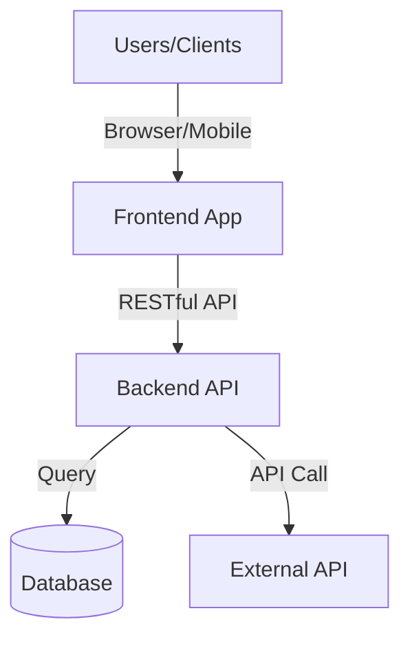
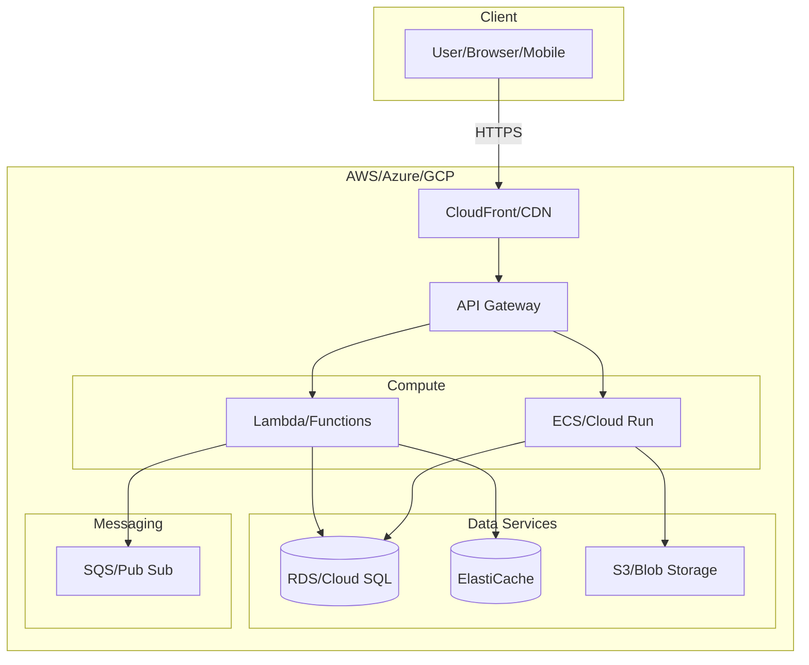
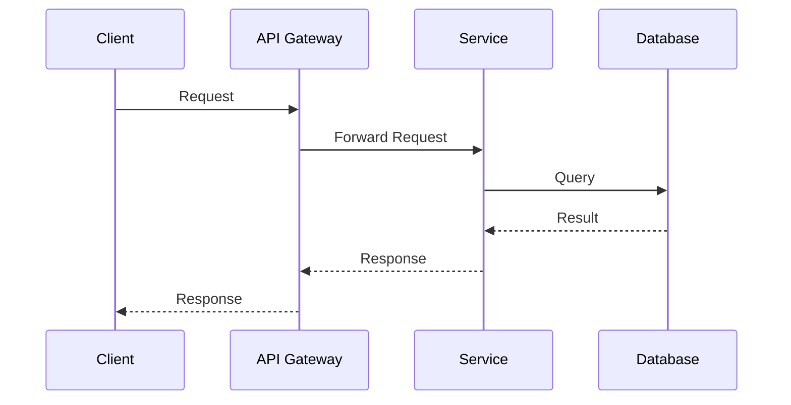
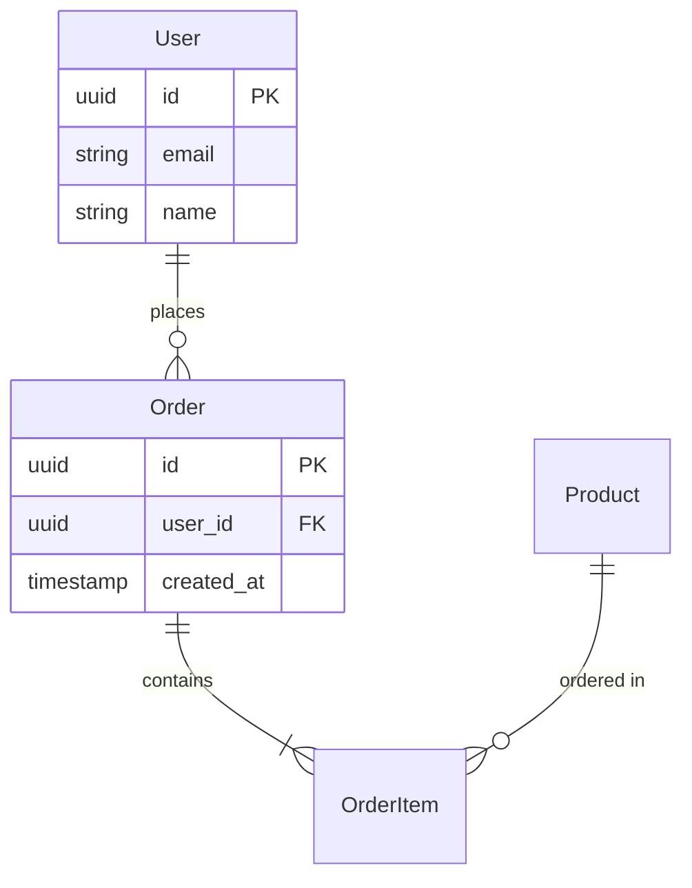

# Cloud Architecture Design

## 1. System Overview
- Project Name
- Business Domain
- Target Users
- Key Objectives

## 2. Cloud Platform Selection

### 2.1 Selected Platform
- **Platform**: AWS / Azure / GCP
- **Rationale**: [團隊經驗、成本、生態系、特定服務需求]
- **Trade-offs**: [與其他平台比較的優缺點]

### 2.2 Current State Analysis (if existing system)

#### Code Analysis Summary (if reverse-engineered from code)
- **Project Structure**: [Directory organization, module breakdown]
- **Technology Stack**: [Frameworks, libraries identified from dependencies]
- **Architecture Pattern**: [Layered, MVC, Hexagonal, etc. - inferred from code structure]
- **Key Components**:
  ```mermaid
  graph TB
      Client[Client/Frontend]
      API[API Layer - routes/controllers]
      Service[Service Layer - business logic]
      Data[Data Layer - models/repositories]
      DB[(Database)]

      Client --> API
      API --> Service
      Service --> Data
      Data --> DB
  ```

#### Current State
- Existing Architecture: [Current architecture style and tech stack]
- Pain Points: [Performance bottlenecks, technical debt, scalability issues]
- Constraints: [Components that cannot be changed]
- Migration Strategy: [Greenfield / Brownfield / Hybrid]

## 3. Cloud Services Architecture

### 3.1 Compute Services
- **Selected Service**: [Lambda/Cloud Functions/Azure Functions / ECS/Cloud Run/Container Instances / EKS/GKE/AKS]
- **Rationale**: [為何選擇 Serverless/Container/VM]
- **Configuration**: [Memory, CPU, Auto Scaling 策略]
- **Trade-offs**: [成本 vs 彈性 vs 控制度]

### 3.2 Database Services
- **Primary Database**: [RDS PostgreSQL/Azure SQL/Cloud SQL / DynamoDB/Cosmos DB/Firestore]
- **Rationale**: [關聯式 vs NoSQL, 資料量級, 查詢模式]
- **Configuration**: [實例規格, Multi-AZ, Read Replicas]
- **Cache**: [ElastiCache Redis/Azure Cache/Memorystore]
- **Rationale for Cache**: [提升效能、降低資料庫負載]

### 3.3 Storage Services
- **Object Storage**: [S3/Blob Storage/Cloud Storage]
- **Use Cases**: [靜態檔案、使用者上傳、備份]
- **File Storage** (若需要): [EFS/Azure Files/Filestore]
- **Configuration**: [儲存等級、生命週期管理、加密]

### 3.4 Messaging & Event Services
- **Queue**: [SQS/Service Bus/Pub/Sub]
- **Event Bus**: [EventBridge/Event Grid/Pub/Sub]
- **Rationale**: [非同步處理、微服務解耦、事件驅動架構]
- **Use Cases**: [背景任務、服務間通訊、事件通知]

### 3.5 API Gateway & Networking
- **API Gateway**: [AWS API Gateway/Azure API Management/Cloud Endpoints]
- **Load Balancer**: [ALB/Application Gateway/Cloud Load Balancing]
- **CDN**: [CloudFront/Azure CDN/Cloud CDN]
- **VPC Design**: [子網規劃、Public/Private Subnet、NAT Gateway]
- **Security Groups/Firewall**: [入站/出站規則]

### 3.6 Evolution Path (if applicable)
- Phase 1: [Immediate changes]
- Phase 2: [Medium-term migration]
- Phase 3: [Long-term target state]

## 4. High-Level System Architecture

### 4.1 System Context Diagram


### 4.2 Cloud Services Component Architecture


### 4.3 Microservice Boundaries (if applicable)
- Service boundary definitions
- Service responsibilities
- Inter-service communication (HTTP/gRPC/Event-Driven)

### 4.4 Key Sequence Diagram


## 5. High-Level API Design
- API Gateway Service (AWS API Gateway/Azure API Management/Cloud Endpoints)
- Authentication & Authorization Strategy
  - JWT/OAuth2/API Key
  - IAM Roles and Policies
- API Versioning Approach (v1, v2)
- Rate Limiting & Throttling (雲端 API Gateway 功能)
- **Note**: 詳細 API 端點定義見 API_ENDPOINTS.md，完整 OpenAPI 規格由 API Designer Agent 設計

## 6. High-Level Data Model

### 6.1 Cloud Database Services
- Primary Database: [RDS PostgreSQL/Azure SQL/Cloud SQL] - Rationale
- NoSQL (若需要): [DynamoDB/Cosmos DB/Firestore] - Use cases
- Cache Layer: [ElastiCache Redis/Azure Cache/Memorystore] - Performance optimization
- Message Queue: [SQS/Service Bus/Pub/Sub] - Async processing

### 6.2 High-Level ER Diagram (實體關聯圖)


**Note:** 此處僅包含實體名稱、關聯關係與關鍵欄位（id, FK）。詳細欄位型別、索引設計、約束條件由 DBA Agent 負責。詳見 ER_DIAGRAM.md。

### 6.3 Data Flow
- Read/Write patterns
- Data synchronization between services (若為微服務架構)

### 6.4 Data Consistency Strategy
- ACID requirements (使用關聯式資料庫時)
- Eventual consistency approach (使用 NoSQL 或事件驅動架構時)
- Distributed transaction handling (若跨服務交易)

## 7. Cost Optimization Strategy
- **Estimated Monthly Cost**:
  - Compute: [估算 Lambda/ECS 成本]
  - Database: [估算 RDS/DynamoDB 成本]
  - Storage: [估算 S3 成本]
  - Network: [估算流量成本]
  - Total: [總計預估成本]
- **Optimization Strategies**:
  - Reserved Instances / Savings Plans (長期穩定負載)
  - Spot Instances / Preemptible VMs (非關鍵工作負載)
  - Auto Scaling (依需求彈性調整)
  - S3 Lifecycle Policies (降低儲存成本)
  - CloudWatch / Cost Explorer 監控

## 8. High Availability & Disaster Recovery
- **Multi-AZ Deployment**: [是/否]
- **Backup Strategy**:
  - RDS Automated Backups (保留天數)
  - S3 Versioning & Replication
- **RTO (Recovery Time Objective)**: [X 分鐘/小時]
- **RPO (Recovery Point Objective)**: [X 分鐘/小時]
- **Failover Strategy**: [自動/手動]

## 9. Security Architecture
- **VPC Design**:
  - Public Subnet (Load Balancer, NAT Gateway)
  - Private Subnet (Compute, Database)
  - Network ACLs & Security Groups
- **IAM Strategy**:
  - Least Privilege Principle
  - Service Roles (Lambda/ECS execution roles)
  - API Gateway Authorization
- **Encryption**:
  - Data at Rest (RDS encryption, S3 encryption)
  - Data in Transit (TLS/SSL)
- **Compliance**: [GDPR/HIPAA/SOC2] (若適用)

## 10. Non-Functional Requirements
- Performance Targets (QPS, Latency)
- Scalability Plan (Auto Scaling 策略)
- Reliability & Availability (SLA目標, 如 99.9%)

## 11. Deployment Architecture
- Environment Strategy (Dev/Staging/Prod)
- CI/CD Pipeline (CodePipeline/Azure DevOps/Cloud Build)
- Infrastructure as Code (Terraform/CloudFormation/ARM Templates)
- Rollback Strategy

## 12. Observability
- **Logging**:
  - AWS: CloudWatch Logs
  - Azure: Log Analytics
  - GCP: Cloud Logging
- **Metrics**:
  - AWS: CloudWatch Metrics
  - Azure: Azure Monitor
  - GCP: Cloud Monitoring
- **Tracing**:
  - AWS: X-Ray
  - Azure: Application Insights
  - GCP: Cloud Trace
- **Alerting**: [告警規則與通知渠道]

## 13. Next Steps
- **Recommended Agents** (按優先順序):
  1. API Designer Agent (若需要完整 OpenAPI 規格)
  2. DBA Agent (若資料模型複雜度 = High/Medium)
  3. Backend Developer Agent
  4. Frontend Developer Agent
  5. DevOps Agent
- **Dependencies**: [需要等待的前置條件]
- **Estimated Timeline**: [整體開發時程估算]
