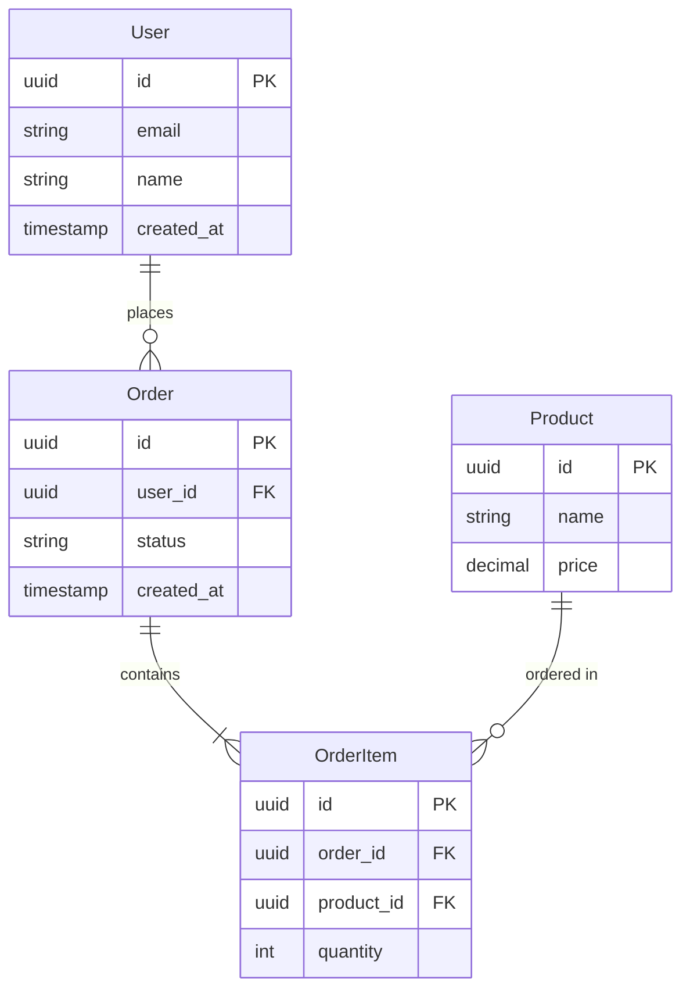

# High-Level Entity Relationship Diagram

## Entity Descriptions

### User
- **Purpose**: 使用者帳號管理
- **Key Relationships**: 一對多訂單

### Order
- **Purpose**: 訂單管理
- **Key Relationships**: 屬於一個使用者，包含多個訂單項目

### Product
- **Purpose**: 產品資訊管理
- **Key Relationships**: 可在多個訂單項目中

### OrderItem
- **Purpose**: 訂單明細
- **Key Relationships**: 屬於一個訂單，關聯一個產品

---

**Note**: 詳細欄位型別、索引設計、約束條件、Partition 策略由 DBA Agent 負責。
