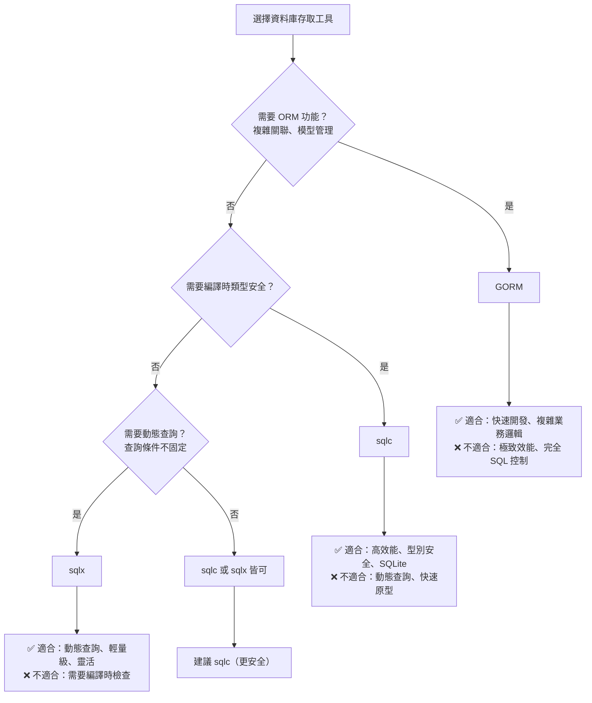

# sqlc 使用範例

## 1. sqlc.yaml 設定檔

```yaml
version: "2"
sql:
  - engine: "postgresql"  # 或 "mysql", "sqlite"
    queries: "queries/"
    schema: "schema.sql"
    gen:
      go:
        package: "db"
        out: "internal/db"
        emit_json_tags: true
        emit_interface: true
        emit_exact_table_names: false
```

## 2. 目錄結構

```
project/
├── sqlc.yaml              # sqlc 設定檔
├── schema.sql             # 資料庫 Schema（來自 DBA）
├── queries/               # SQL 查詢檔案（手寫）
│   ├── users.sql
│   └── orders.sql
├── internal/
│   ├── db/                # sqlc 生成的代碼（自動生成）
│   │   ├── db.go
│   │   ├── models.go
│   │   ├── querier.go
│   │   ├── users.sql.go
│   │   └── orders.sql.go
│   ├── model/             # Domain Models（手寫，用於 API）
│   │   ├── user.go
│   │   └── order.go
│   ├── repository/        # Repository（使用 sqlc Queries）
│   │   └── user_repository.go
│   ├── service/
│   └── handler/
└── Makefile
```

## 3. 撰寫 SQL 查詢（queries/users.sql）

```sql
-- name: GetUser :one
SELECT * FROM users
WHERE id = $1 AND deleted_at IS NULL
LIMIT 1;

-- name: GetUserByEmail :one
SELECT * FROM users
WHERE email = $1 AND deleted_at IS NULL
LIMIT 1;

-- name: ListUsers :many
SELECT * FROM users
WHERE deleted_at IS NULL
ORDER BY created_at DESC
LIMIT $1 OFFSET $2;

-- name: CreateUser :one
INSERT INTO users (
    name, email, status, created_at, updated_at
) VALUES (
    $1, $2, $3, $4, $5
)
RETURNING *;

-- name: UpdateUser :one
UPDATE users
SET name = $1, email = $2, updated_at = $3
WHERE id = $4 AND deleted_at IS NULL
RETURNING *;

-- name: DeleteUser :exec
UPDATE users
SET deleted_at = $1
WHERE id = $2;

-- name: CountUsers :one
SELECT COUNT(*) FROM users
WHERE deleted_at IS NULL;
```

## 4. 執行 sqlc generate

```bash
# Makefile
.PHONY: sqlc
sqlc:
	sqlc generate

# 執行
make sqlc
```

## 5. sqlc 自動生成的代碼（internal/db/users.sql.go）

```go
// Code generated by sqlc. DO NOT EDIT.

package db

import (
	"context"
	"time"

	"github.com/google/uuid"
)

const getUser = `-- name: GetUser :one
SELECT id, name, email, status, created_at, updated_at, deleted_at FROM users
WHERE id = $1 AND deleted_at IS NULL
LIMIT 1
`

func (q *Queries) GetUser(ctx context.Context, id uuid.UUID) (User, error) {
	row := q.db.QueryRowContext(ctx, getUser, id)
	var i User
	err := row.Scan(
		&i.ID,
		&i.Name,
		&i.Email,
		&i.Status,
		&i.CreatedAt,
		&i.UpdatedAt,
		&i.DeletedAt,
	)
	return i, err
}

// ... 其他生成的函數
```

## 6. Repository 層使用 sqlc（internal/repository/user_repository.go）

```go
package repository

import (
	"context"
	"database/sql"
	"log/slog"

	"github.com/google/uuid"
	"your-project/internal/db"
)

type UserRepository interface {
	GetByID(ctx context.Context, id uuid.UUID) (*db.User, error)
	GetByEmail(ctx context.Context, email string) (*db.User, error)
	List(ctx context.Context, limit, offset int32) ([]db.User, error)
	Create(ctx context.Context, arg db.CreateUserParams) (*db.User, error)
	Update(ctx context.Context, arg db.UpdateUserParams) (*db.User, error)
	Delete(ctx context.Context, id uuid.UUID) error
}

type userRepository struct {
	queries *db.Queries  // sqlc 生成的 Queries
	logger  *slog.Logger
}

func NewUserRepository(database *sql.DB, logger *slog.Logger) UserRepository {
	return &userRepository{
		queries: db.New(database),
		logger:  logger,
	}
}

func (r *userRepository) GetByID(ctx context.Context, id uuid.UUID) (*db.User, error) {
	user, err := r.queries.GetUser(ctx, id)
	if err != nil {
		if err == sql.ErrNoRows {
			return nil, ErrUserNotFound
		}
		r.logger.Error("failed to get user", "error", err, "id", id)
		return nil, err
	}
	return &user, nil
}

func (r *userRepository) GetByEmail(ctx context.Context, email string) (*db.User, error) {
	user, err := r.queries.GetUserByEmail(ctx, email)
	if err != nil {
		if err == sql.ErrNoRows {
			return nil, ErrUserNotFound
		}
		r.logger.Error("failed to get user by email", "error", err, "email", email)
		return nil, err
	}
	return &user, nil
}

func (r *userRepository) Create(ctx context.Context, arg db.CreateUserParams) (*db.User, error) {
	user, err := r.queries.CreateUser(ctx, arg)
	if err != nil {
		r.logger.Error("failed to create user", "error", err)
		return nil, err
	}
	return &user, nil
}
```

## 7. main.go 初始化（使用 database/sql）

```go
package main

import (
	"database/sql"
	"log/slog"
	"os"

	_ "github.com/lib/pq"  // PostgreSQL driver
	// _ "github.com/mattn/go-sqlite3"  // SQLite driver
)

func main() {
	logger := slog.New(slog.NewJSONHandler(os.Stdout, nil))

	// 使用 database/sql（非 GORM）
	db, err := sql.Open("postgres", os.Getenv("DATABASE_URL"))
	if err != nil {
		logger.Error("failed to connect database", "error", err)
		os.Exit(1)
	}
	defer db.Close()

	// Ping to verify connection
	if err := db.Ping(); err != nil {
		logger.Error("failed to ping database", "error", err)
		os.Exit(1)
	}

	// Initialize Repository（使用 sqlc）
	userRepo := repository.NewUserRepository(db, logger)

	// Initialize Service
	userService := service.NewUserService(userRepo, logger)

	// ... 初始化 Handler、Router
}
```

## 8. Makefile 完整範例

```makefile
.PHONY: sqlc build run test

# Generate sqlc code
sqlc:
	sqlc generate

# Build
build:
	go build -o bin/api cmd/api/main.go

# Run
run:
	go run cmd/api/main.go

# Test
test:
	go test ./...

# Test with coverage
test-coverage:
	go test -cover ./...

# Apply migrations (using golang-migrate)
migrate-up:
	migrate -path migrations -database "${DATABASE_URL}" up

# Rollback migrations
migrate-down:
	migrate -path migrations -database "${DATABASE_URL}" down 1
```

## 9. sqlc vs sqlx vs GORM 比較

| 項目 | sqlc | sqlx | GORM |
|------|------|------|------|
| **本質** | 編譯時 Code Generator | 執行時 Query Builder | 執行時 ORM |
| **方式** | 寫 SQL，生成 Go 代碼 | 寫 SQL 字串，手動 mapping | 用 Go 代碼操作資料庫 |
| **支援資料庫** | PostgreSQL, MySQL, SQLite | 所有 database/sql 驅動 | PostgreSQL, MySQL, SQLite, MSSQL |
| **效能** | ✅ 零執行時開銷（純 SQL） | ✅ 輕量（少量反射） | ⚠️ 執行時反射 |
| **Type Safety** | ✅ 編譯時檢查 | ❌ 執行時錯誤（struct tag） | ✅ 執行時檢查 |
| **SQL 控制** | ✅ 完全控制（手寫 SQL） | ✅ 完全控制（手寫 SQL） | ⚠️ ORM 生成 SQL |
| **IDE 支援** | ✅ 自動完成（生成函數） | ❌ SQL 是字串 | ✅ 自動完成 |
| **動態查詢** | ❌ 需寫多個 SQL | ✅ 字串拼接靈活 | ✅ Where().Or() |
| **Named Params** | ❌ 使用 `$1, $2`（PostgreSQL） | ✅ 支援 `:name` | ✅ 支援 `@name` |
| **Migration** | ❌ 需額外工具（golang-migrate） | ❌ 需額外工具 | ⚠️ AutoMigrate（DBA 禁止） |
| **關聯管理** | ❌ 需手動 JOIN | ❌ 需手動 JOIN | ✅ Preload 自動 |
| **學習曲線** | ⚠️ 需熟悉 SQL + sqlc 語法 | ✅ 僅需熟悉 SQL | ⚠️ 需學 ORM API |
| **額外工具** | ⚠️ 需 sqlc CLI | ❌ 無（純 Go library） | ❌ 無（純 Go library） |
| **適用場景** | 高效能、編譯時安全、完全 SQL 控制 | 輕量、動態查詢、熟悉 SQL | 快速開發、複雜關聯 |

## 10. 選擇決策樹



## 11. 何時選擇各工具？

### ✅ 推薦使用 sqlc：

- 需要極致效能（零執行時開銷）
- 需要編譯時類型安全（避免執行時錯誤）
- 查詢邏輯固定（CRUD + 常見業務查詢）
- 團隊熟悉 SQL（DBA 主導）
- 使用 PostgreSQL/MySQL/SQLite
- 專案規模大（編譯時檢查避免 bug）

### ✅ 推薦使用 sqlx：

- 需要動態查詢（查詢條件不固定）
- 輕量級專案（不想引入額外工具）
- 需要 Named Parameters（`:name` 比 `$1` 可讀）
- 快速原型開發（無需生成步驟）
- 團隊熟悉 SQL 且不需編譯時檢查
- 支援多種資料庫（包括 MSSQL、Oracle）

### ✅ 推薦使用 GORM：

- 需要複雜關聯管理（Preload、Association）
- 快速開發 CRUD（AutoMigrate、Hook）
- 團隊不熟悉 SQL（ORM 抽象）
- 需要跨資料庫支援（輕鬆切換 DB）

### ❌ 不推薦 sqlc：

- 動態查詢為主（需要大量條件組合）
- 快速原型開發（生成步驟拖慢速度）
- 團隊不熟悉 SQL

### ❌ 不推薦 sqlx：

- 需要編譯時安全（避免執行時錯誤）
- 複雜關聯管理（手動 JOIN 太繁瑣）
- 團隊不熟悉 SQL

### ❌ 不推薦 GORM：

- 需要極致效能（執行時反射開銷）
- 需要完全 SQL 控制（複雜查詢優化）
- 使用 ⚠️ AutoMigrate（DBA Agent 已禁止）
