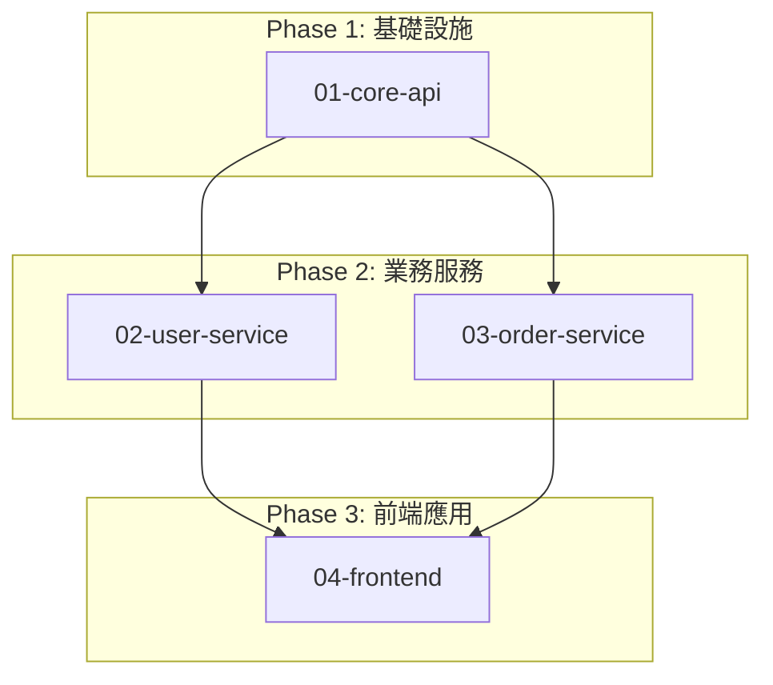

# Project Split Plan: [專案名稱]

## 切分決策

**切分原因:**
- [ ] 功能模組 > 3 個
- [ ] 微服務數量 > 2 個
- [ ] 資料實體 > 7 個
- [ ] 外部整合 > 2 個
- [ ] 預估設計時間 > 60 分鐘
- [ ] 跨多個業務領域

**切分策略:** [策略 A/B/C/D]
- **策略 A** - 按業務領域切分 (適用多業務領域專案)
- **策略 B** - 按技術層次切分 (適用分層架構專案)
- **策略 C** - 按開發優先級切分 (適用 MVP + 進階功能)
- **策略 D** - 混合策略 (適用複雜大型專案)

**理由:** [說明為什麼選擇此策略]

**預估時間:**
- 原本完整設計: [X] 分鐘
- 切分後總時間: [Y] 分鐘 (包含各子專案累計時間)

---

## 子專案清單

### Phase 1: [階段名稱 - 如：基礎設施]

#### 01-[子專案名稱]
- **範圍:** [簡短描述此子專案的功能範圍]
- **包含功能:**
  - [功能 1]
  - [功能 2]
  - [功能 3]
- **不包含功能:**
  - [明確列出不在此子專案範圍內的功能]
- **預估時間:** [分鐘]
- **優先級:** HIGH / MEDIUM / LOW
- **依賴:** 無 / [依賴的子專案編號]
- **複雜度:** HIGH / MEDIUM / LOW
- **狀態:** ⏳ 待開始 / 🔄 進行中 / ✅ 已完成
- **Brief 檔案:** `.claude/planning/[project-name]/subprojects/01-[name].md`

#### 02-[子專案名稱]
- **範圍:** [描述]
- **包含功能:**
  - [...]
- **預估時間:** [分鐘]
- **優先級:** HIGH / MEDIUM / LOW
- **依賴:** [01-xxx]
- **複雜度:** HIGH / MEDIUM / LOW
- **狀態:** ⏳ 待開始
- **Brief 檔案:** `.claude/planning/[project-name]/subprojects/02-[name].md`

### Phase 2: [階段名稱 - 如：業務服務]

#### 03-[子專案名稱]
- **範圍:** [描述]
- **包含功能:**
  - [...]
- **預估時間:** [分鐘]
- **優先級:** HIGH / MEDIUM / LOW
- **依賴:** [01-xxx, 02-xxx]
- **複雜度:** HIGH / MEDIUM / LOW
- **狀態:** ⏳ 待開始
- **Brief 檔案:** `.claude/planning/[project-name]/subprojects/03-[name].md`

### Phase 3: [階段名稱 - 如：前端應用]

#### 04-[子專案名稱]
- **範圍:** [描述]
- **包含功能:**
  - [...]
- **預估時間:** [分鐘]
- **優先級:** MEDIUM / LOW
- **依賴:** [所有前面的子專案]
- **複雜度:** MEDIUM / LOW
- **狀態:** ⏳ 待開始
- **Brief 檔案:** `.claude/planning/[project-name]/subprojects/04-[name].md`

---

## 依賴關係圖



---

## 整合策略

### API Gateway
- **設計:** [統一入口、路由規則、服務發現]
- **認證:** [JWT/OAuth2 統一認證]
- **Rate Limiting:** [每個服務的限流策略]

### 服務間通訊
- **同步通訊:** RESTful API / gRPC
- **異步通訊:** Message Queue (Kafka/RabbitMQ/Redis)
- **資料格式:** JSON / Protocol Buffers

### 資料一致性
- **策略:** Saga Pattern / 2PC / Eventual Consistency
- **補償機制:** [失敗回滾策略]

### 部署策略
- **容器化:** Docker
- **編排:** Kubernetes / Docker Compose
- **CI/CD:** [GitHub Actions / GitLab CI]

---

## 建議執行順序

1. **Phase 1:** [子專案 01] (建立基礎，無依賴)
   - 完成後交付：API Gateway 架構 + 認證機制

2. **Phase 2:** [子專案 02, 03] (可並行開發，依賴 Phase 1)
   - 完成後交付：核心業務服務 API

3. **Phase 3:** [子專案 04] (整合所有服務)
   - 完成後交付：完整應用程式

**並行開發建議:**
- Phase 2 中的子專案 02 和 03 可以同時開發 (無互相依賴)
- Frontend 可在後端 API 規格確定後，使用 Mock API 並行開發

---

## 進度追蹤

| 子專案 | 範圍 | 預估時間 | 優先級 | 依賴 | 狀態 | 完成時間 |
|--------|------|----------|--------|------|------|----------|
| 01-[name] | [範圍] | [X] min | HIGH | 無 | ⏳ 待開始 | - |
| 02-[name] | [範圍] | [X] min | HIGH | 01 | ⏳ 待開始 | - |
| 03-[name] | [範圍] | [X] min | MEDIUM | 01 | ⏳ 待開始 | - |
| 04-[name] | [範圍] | [X] min | MEDIUM | 01,02,03 | ⏳ 待開始 | - |

**總進度:**
- 總專案數: [N]
- 已完成: 0 (0%)
- 進行中: 0
- 待開始: [N]

---

## 遞迴切分機制 (Recursive Splitting)

⚠️ **子專案二次切分規則:**

如果某個子專案在執行 STEP 1.5 評估後，仍然符合切分條件（預估時間 > 60 分鐘 或 複雜度 HIGH），則該子專案可以**遞迴切分**為更小的子任務。

**遞迴切分流程:**
1. Architect Agent 評估子專案 `XX-subproject` 時觸發 STEP 1.5
2. 判定需要切分 → 建立子目錄:
   ```
   .claude/planning/[project]/subprojects/XX-subproject/
   ├── PROJECT_SPLIT.md          # 該子專案的切分規劃
   ├── subprojects/
   │   ├── XX-01-[name].md
   │   ├── XX-02-[name].md
   │   └── XX-03-[name].md
   └── completed/
   ```
3. Orchestrator 讀取 `XX-subproject/PROJECT_SPLIT.md`
4. 逐個完成 `XX-01`, `XX-02`, `XX-03` 等子任務
5. 全部完成後，移動整個 `XX-subproject/` 目錄至 `completed/`

**命名規範:**
- 一級子專案: `01-core-api`, `02-user-service`
- 二級子專案: `02-01-user-model`, `02-02-user-api`, `02-03-user-auth`
- 三級子專案 (若需要): `02-01-01-xxx`

**最大遞迴深度:** 3 層 (避免過度切分導致管理複雜)

---

## 下一步行動

**當前階段:** Phase 1

**首要任務:**
- 子專案: [01-xxx]
- 輸入檔案: `.claude/planning/[project]/subprojects/01-[name].md`
- 執行模式: 一般模式 (STEP 2 → 3 → 4 → 5)
- 預估時間: [X] 分鐘

**Orchestrator 調用指令:**
```javascript
Task({
  subagent_type: "architect",
  description: "設計子專案: 01-[name]",
  prompt: `
    [從 .claude/agents/architect.md 讀取的完整內容]

    [當前任務]
    為子專案設計完整架構 (這是大專案的一部分)

    [輸入資料]
    ${READ('.claude/planning/[project]/subprojects/01-[name].md')}

    [重要約束]
    - 遵循 PROJECT_SPLIT.md 的整體整合策略
    - 維持與其他子專案的介面契約
    - 如果此子專案複雜度仍然很高 (> 90 分鐘)，可執行二次切分

    [輸出要求]
    - DESIGN.md (專注於此子專案範圍)
    - OPENAPI.yaml (此子專案的 API 端點)
    或
    - 二次切分的 PROJECT_SPLIT.md (若觸發遞迴切分)
  `
})
```

---

## 備註

**技術債追蹤:**
- [記錄在切分過程中發現的技術債或待優化項目]

**風險評估:**
- [列出子專案之間整合可能遇到的風險]

**後續整合檢查點:**
- [ ] 所有子專案 API 規格互相兼容
- [ ] 認證授權機制統一
- [ ] 日誌與監控標準一致
- [ ] 部署腳本整合測試
