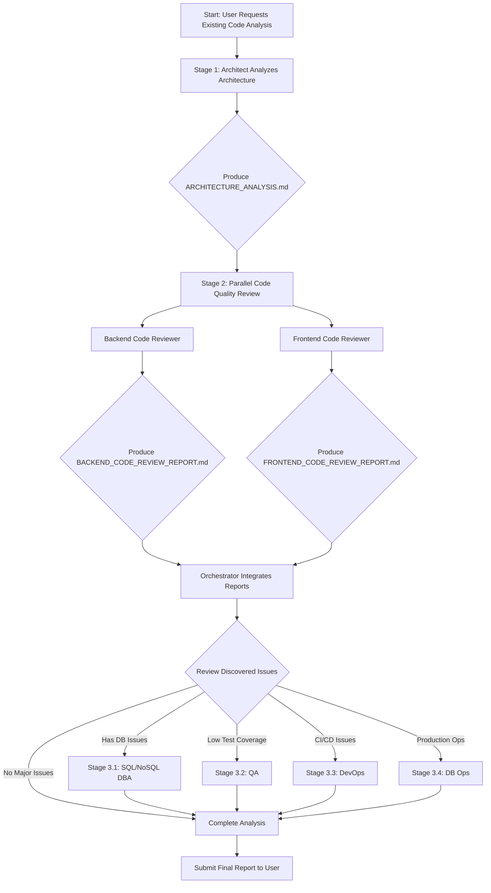

# Codebase Analysis Flow

**Applicable Scenarios:** Analyzing existing codebase and architecture

**Trigger Conditions:**
- User requests analysis of existing project
- Need to understand code quality and architecture design
- Testing sub-agent configuration
- Pre-refactoring assessment
- Technical debt analysis

---

## Recommended Analysis Flow

### Stage 1: Architecture and Design Analysis (Required)

**Invoke:** Architect agent

**Purpose:**
- Analyze overall system architecture
- Identify design patterns (Repository, Service Layer, DI, etc.)
- Evaluate technology stack selection
- Analyze directory structure and modular design

**Output Deliverables:**
- `docs/ARCHITECTURE_ANALYSIS.md`
- Architecture diagrams (Mermaid format)
- Design pattern list
- Technology stack evaluation report

**Execution Command Example:**
```
→ Task(
    subagent_type: "general-purpose",
    description: "Invoke Architect to analyze project architecture",
    prompt: `
      ${Load .claude/templates/sub-agent-runtime-core.md}
      ${Load .claude/agents/architect.md}

      [Current Task]
      Analyze existing project's architecture design

      [Input Data]
      - Project path: {project_path}
      - Tech stack: {tech_stack}
      - Test coverage: {test_coverage}

      [Analysis Focus]
      1. Overall system architecture
      2. Design pattern identification
      3. Technology stack evaluation
      4. Modularity level
      5. Maintainability assessment

      [Expected Output]
      Produce docs/ARCHITECTURE_ANALYSIS.md, including:
      - Architecture diagram (Mermaid)
      - Design pattern analysis
      - Technology stack list and evaluation
      - Improvement recommendations
    `
  )
```

---

### Stage 2: Code Quality Review (Parallel Execution)

**Invoke:** Backend Code Reviewer + Frontend Code Reviewer (in parallel)

#### 2.1 Backend Code Reviewer

**Purpose:**
- Review backend code quality
- Check code conventions and best practices
- Evaluate test coverage
- Identify security issues
- Performance bottleneck analysis

**Output Deliverables:**
- `docs/BACKEND_CODE_REVIEW_REPORT.md`
- Issue list (Critical/Major/Minor)
- Improvement recommendations

**Execution Command Example:**
```
→ Task(
    subagent_type: "general-purpose",
    description: "Invoke Backend Code Reviewer to review backend code",
    prompt: `
      ${Load .claude/templates/sub-agent-runtime-core.md}
      ${Load .claude/agents/backend-code-reviewer.md}

      [Current Task]
      Review existing project's backend code quality

      [Input Data]
      - Project path: {project_path}
      - Programming language: {programming_language}
      - Test coverage: {current_coverage}%

      [Review Focus]
      1. Code conventions and style
      2. Test coverage assessment
      3. Security issues
      4. Performance bottlenecks
      5. Error handling mechanisms
      6. Dependency management

      [Expected Output]
      Produce docs/BACKEND_CODE_REVIEW_REPORT.md
    `
  )
```

#### 2.2 Frontend Code Reviewer

**Purpose:**
- Review frontend code quality
- Check React/Vue/Angular best practices
- Evaluate component design
- Review state management
- UI/UX code quality

**Output Deliverables:**
- `docs/FRONTEND_CODE_REVIEW_REPORT.md`
- Issue list
- Improvement recommendations

**Execution Command Example:**
```
→ Task(
    subagent_type: "general-purpose",
    description: "Invoke Frontend Code Reviewer to review frontend code",
    prompt: `
      ${Load .claude/templates/sub-agent-runtime-core.md}
      ${Load .claude/agents/frontend-code-reviewer.md}

      [Current Task]
      Review existing project's frontend code quality

      [Input Data]
      - Project path: {project_path}/frontend
      - Framework: {frontend_framework}
      - Test coverage: {current_coverage}%

      [Review Focus]
      1. React/Vue/Angular best practices
      2. Component design and reusability
      3. State management
      4. Test coverage assessment
      5. Performance optimization
      6. Accessibility design (a11y)

      [Expected Output]
      Produce docs/FRONTEND_CODE_REVIEW_REPORT.md
    `
  )
```

**Parallel Execution:**
```
→ Invoke Backend Code Reviewer and Frontend Code Reviewer simultaneously
→ Wait for both to complete before proceeding to next stage
```

---

### Stage 3: Specialized Domain Analysis (Execute as Needed)

Based on findings from Stage 1 and 2, selectively invoke specialized agents:

#### 3.1 SQL DBA (If Using Relational Database)

**Trigger Conditions:**
- SQL schema design issues found
- Query performance problems
- Improper index strategy

**Output Deliverables:**
- `docs/SQL_SCHEMA_REVIEW.md`
- `docs/QUERY_OPTIMIZATION.md`

#### 3.2 NoSQL DBA (If Using NoSQL)

**Trigger Conditions:**
- Document model design issues
- Improper partition key
- Index strategy problems

**Output Deliverables:**
- `docs/NOSQL_SCHEMA_REVIEW.md`
- `docs/INDEX_STRATEGY.md`

#### 3.3 QA (If Test Coverage is Low)

**Trigger Conditions:**
- Test coverage < 80%
- Missing integration tests
- Missing E2E tests

**Output Deliverables:**
- `docs/QA_TEST_STRATEGY.md`
- Test improvement plan

#### 3.4 DevOps (If Deployment/CI/CD Issues)

**Trigger Conditions:**
- CI/CD pipeline issues
- Incomplete deployment process
- Missing monitoring and logging

**Output Deliverables:**
- `docs/DEVOPS_REVIEW.md`
- CI/CD improvement recommendations

#### 3.5 DB Ops (If Production Environment)

**Trigger Conditions:**
- Missing backup strategy
- Missing disaster recovery plan
- Missing high availability configuration

**Output Deliverables:**
- `docs/BACKUP_STRATEGY.md`
- `docs/HA_DR_PLAN.md`

---

## Complete Execution Flow Diagram



---

## Orchestrator Execution Examples

### Complete Analysis (Option A)

```
User: Please analyze web4ux project's architecture and code quality

Orchestrator:
✅ Starting codebase analysis flow

Stage 1/3: Architecture Analysis
→ Invoke Architect agent
→ Analyze project structure, design patterns, tech stack
→ ✅ Produce docs/ARCHITECTURE_ANALYSIS.md

Stage 2/3: Code Quality Review (Parallel)
→ Invoke Backend Code Reviewer (Go)
→ Invoke Frontend Code Reviewer (React)
→ ✅ Produce docs/BACKEND_CODE_REVIEW_REPORT.md
→ ✅ Produce docs/FRONTEND_CODE_REVIEW_REPORT.md

📊 Analysis Report Summary:
- Architecture Design: Clean Architecture + Repository Pattern ✅
- Backend Code: 89.2% test coverage ✅
- Frontend Code: 35.14% test coverage ⚠️
- Database: SQLite + SQLC ✅

🔍 Issues Found:
- ⚠️ Frontend test coverage is low (35.14%)

Stage 3/3: Specialized Domain Analysis
→ Recommend invoking QA agent to improve frontend test strategy

Continue with QA analysis?
```

### Quick Validation (Option B)

```
User: Quick check of web4ux architecture

Orchestrator:
✅ Executing quick architecture analysis

→ Invoke Architect agent
→ ✅ Produce docs/ARCHITECTURE_ANALYSIS.md

📊 Architecture Summary:
- Framework: Wails v2 (Go + React)
- Architecture Pattern: Clean Architecture
- Design Patterns: Repository, Service Layer, DI
- Database: SQLite + SQLC
- Testing: 89.2% (Go), 35.14% (React)

✅ Analysis Complete
```

---

## Output Deliverables List

### Required Deliverables (Stage 1 + 2)

- ✅ `docs/ARCHITECTURE_ANALYSIS.md`
- ✅ `docs/BACKEND_CODE_REVIEW_REPORT.md`
- ✅ `docs/FRONTEND_CODE_REVIEW_REPORT.md`

### Optional Deliverables (Stage 3)

- `docs/SQL_SCHEMA_REVIEW.md` (SQL DBA)
- `docs/NOSQL_SCHEMA_REVIEW.md` (NoSQL DBA)
- `docs/QA_TEST_STRATEGY.md` (QA)
- `docs/DEVOPS_REVIEW.md` (DevOps)
- `docs/BACKUP_STRATEGY.md` (DB Ops)
- `docs/HA_DR_PLAN.md` (DB Ops)

---

## Quick Command Reference

**Complete Analysis (3 agents):**
```
Please sequentially invoke:
1. Architect to analyze architecture
2. Backend Code Reviewer to review backend
3. Frontend Code Reviewer to review frontend
```

**Quick Validation (1 agent):**
```
Please invoke Architect to analyze architecture
```

**In-depth Analysis (5+ agents):**
```
Please sequentially invoke:
1. Architect
2. Backend Code Reviewer + Frontend Code Reviewer (parallel)
3. SQL DBA to analyze database schema
4. QA to analyze test strategy
5. DevOps to review CI/CD
```

---

## Notes

1. **Parallel Execution Principle**
   - Backend and Frontend Code Reviewers can run in parallel
   - Specialized domain agents (Stage 3) can run in parallel

2. **Output Directory**
   - All analysis reports unified in `docs/` directory

3. **Report Format**
   - Use Markdown format
   - Include Mermaid diagrams
   - Issue classification: Critical / Major / Minor

4. **Follow-up Actions**
   - Decide if refactoring needed based on reports
   - Create Implementation Plan to fix issues
   - Track improvement progress

---

**Related Documents:**
- `.claude/workflows/product-development-flow.md` - Product Development Flow
- `.claude/core/agent-invocation.md` - Agent Invocation Mechanism
- `.claude/ORCHESTRATOR_USAGE_TEMPLATE.md` - Invocation Examples
