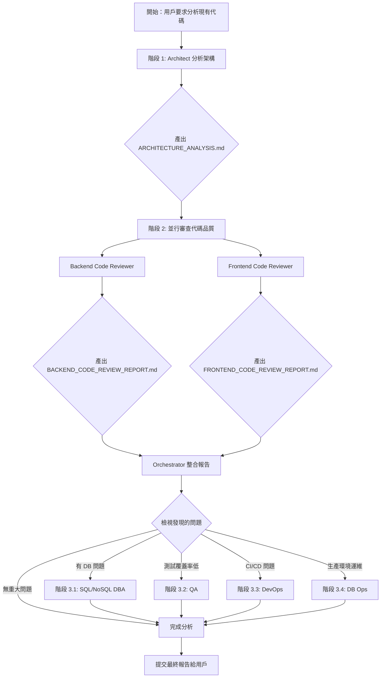

# Codebase Analysis Flow

**適用場景：** 分析現有代碼庫與架構

**觸發條件：**
- 用戶要求分析現有專案
- 需要了解代碼品質和架構設計
- 測試 sub-agent 配置
- 重構前的評估
- 技術債務分析

---

## 推薦的分析流程

### 階段 1：架構與設計分析（必要）

**調用：Architect agent**

**目的：**
- 分析整體系統架構
- 識別設計模式（Repository、Service Layer、DI 等）
- 評估技術棧選型
- 分析目錄結構和模組化設計

**輸出交付物：**
- `docs/ARCHITECTURE_ANALYSIS.md`
- 架構圖（Mermaid 格式）
- 設計模式清單
- 技術棧評估報告

**執行指令範例：**
```
→ Task(
    subagent_type: "general-purpose",
    description: "調用 Architect 分析專案架構",
    prompt: `
      ${載入 .claude/templates/sub-agent-runtime-core.md}
      ${載入 .claude/agents/architect.md}

      [當前任務]
      分析現有專案的架構設計

      [輸入資料]
      - 專案路徑: {project_path}
      - 技術棧: {tech_stack}
      - 測試覆蓋率: {test_coverage}

      [分析重點]
      1. 整體系統架構
      2. 設計模式識別
      3. 技術棧評估
      4. 模組化程度
      5. 可維護性評估

      [預期輸出]
      產出 docs/ARCHITECTURE_ANALYSIS.md，包含：
      - 架構圖（Mermaid）
      - 設計模式分析
      - 技術棧清單與評價
      - 改進建議
    `
  )
```

---

### 階段 2：代碼品質審查（並行執行）

**調用：Backend Code Reviewer + Frontend Code Reviewer（並行）**

#### 2.1 Backend Code Reviewer

**目的：**
- 審查後端代碼品質
- 檢查代碼慣例和最佳實踐
- 評估測試覆蓋率
- 識別安全性問題
- 效能瓶頸分析

**輸出交付物：**
- `docs/BACKEND_CODE_REVIEW_REPORT.md`
- 問題清單（Critical/Major/Minor）
- 改進建議

**執行指令範例：**
```
→ Task(
    subagent_type: "general-purpose",
    description: "調用 Backend Code Reviewer 審查後端代碼",
    prompt: `
      ${載入 .claude/templates/sub-agent-runtime-core.md}
      ${載入 .claude/agents/backend-code-reviewer.md}

      [當前任務]
      審查現有專案的後端代碼品質

      [輸入資料]
      - 專案路徑: {project_path}
      - 程式語言: {programming_language}
      - 測試覆蓋率: {current_coverage}%

      [審查重點]
      1. 代碼慣例和風格
      2. 測試覆蓋率評估
      3. 安全性問題
      4. 效能瓶頸
      5. 錯誤處理機制
      6. 依賴管理

      [預期輸出]
      產出 docs/BACKEND_CODE_REVIEW_REPORT.md
    `
  )
```

#### 2.2 Frontend Code Reviewer

**目的：**
- 審查前端代碼品質
- 檢查 React/Vue/Angular 最佳實踐
- 評估組件設計
- 檢視狀態管理
- UI/UX 代碼品質

**輸出交付物：**
- `docs/FRONTEND_CODE_REVIEW_REPORT.md`
- 問題清單
- 改進建議

**執行指令範例：**
```
→ Task(
    subagent_type: "general-purpose",
    description: "調用 Frontend Code Reviewer 審查前端代碼",
    prompt: `
      ${載入 .claude/templates/sub-agent-runtime-core.md}
      ${載入 .claude/agents/frontend-code-reviewer.md}

      [當前任務]
      審查現有專案的前端代碼品質

      [輸入資料]
      - 專案路徑: {project_path}/frontend
      - 框架: {frontend_framework}
      - 測試覆蓋率: {current_coverage}%

      [審查重點]
      1. React/Vue/Angular 最佳實踐
      2. 組件設計和複用性
      3. 狀態管理
      4. 測試覆蓋率評估
      5. 效能優化
      6. 無障礙設計（a11y）

      [預期輸出]
      產出 docs/FRONTEND_CODE_REVIEW_REPORT.md
    `
  )
```

**並行執行：**
```
→ 同時調用 Backend Code Reviewer 和 Frontend Code Reviewer
→ 等待兩者完成後進入下一階段
```

---

### 階段 3：專業領域分析（按需執行）

根據階段 1 和 2 的發現，選擇性調用專業 agent：

#### 3.1 SQL DBA（如果使用關聯式資料庫）

**觸發條件：**
- 發現 SQL schema 設計問題
- 查詢效能問題
- 索引策略不當

**輸出交付物：**
- `docs/SQL_SCHEMA_REVIEW.md`
- `docs/QUERY_OPTIMIZATION.md`

#### 3.2 NoSQL DBA（如果使用 NoSQL）

**觸發條件：**
- Document model 設計問題
- Partition key 不當
- 索引策略問題

**輸出交付物：**
- `docs/NOSQL_SCHEMA_REVIEW.md`
- `docs/INDEX_STRATEGY.md`

#### 3.3 QA（如果測試覆蓋率低）

**觸發條件：**
- 測試覆蓋率 < 80%
- 缺少整合測試
- 缺少 E2E 測試

**輸出交付物：**
- `docs/QA_TEST_STRATEGY.md`
- 測試改進計畫

#### 3.4 DevOps（如果有部署/CI/CD 問題）

**觸發條件：**
- CI/CD pipeline 有問題
- 部署流程不完善
- 缺少監控和日誌

**輸出交付物：**
- `docs/DEVOPS_REVIEW.md`
- CI/CD 改進建議

#### 3.5 DB Ops（如果是生產環境）

**觸發條件：**
- 缺少備份策略
- 缺少災難復原計畫
- 缺少高可用性配置

**輸出交付物：**
- `docs/BACKUP_STRATEGY.md`
- `docs/HA_DR_PLAN.md`

---

## 完整執行流程圖



---

## Orchestrator 執行範例

### 完整分析（選項 A）

```
用戶：請分析 web4ux 專案的架構和代碼品質

Orchestrator：
✅ 開始代碼庫分析流程

階段 1/3：架構分析
→ 調用 Architect agent
→ 分析專案結構、設計模式、技術棧
→ ✅ 產出 docs/ARCHITECTURE_ANALYSIS.md

階段 2/3：代碼品質審查（並行）
→ 調用 Backend Code Reviewer (Go)
→ 調用 Frontend Code Reviewer (React)
→ ✅ 產出 docs/BACKEND_CODE_REVIEW_REPORT.md
→ ✅ 產出 docs/FRONTEND_CODE_REVIEW_REPORT.md

📊 分析報告摘要：
- 架構設計：Clean Architecture + Repository Pattern ✅
- 後端代碼：89.2% 測試覆蓋率 ✅
- 前端代碼：35.14% 測試覆蓋率 ⚠️
- 資料庫：SQLite + SQLC ✅

🔍 發現問題：
- ⚠️ 前端測試覆蓋率偏低（35.14%）

階段 3/3：專業領域分析
→ 建議調用 QA agent 改善前端測試策略

是否繼續執行 QA 分析？
```

### 快速驗證（選項 B）

```
用戶：快速檢視一下 web4ux 的架構

Orchestrator：
✅ 執行快速架構分析

→ 調用 Architect agent
→ ✅ 產出 docs/ARCHITECTURE_ANALYSIS.md

📊 架構摘要：
- 框架：Wails v2 (Go + React)
- 架構模式：Clean Architecture
- 設計模式：Repository, Service Layer, DI
- 資料庫：SQLite + SQLC
- 測試：89.2% (Go), 35.14% (React)

✅ 分析完成
```

---

## 輸出交付物清單

### 必要交付物（階段 1 + 2）

- ✅ `docs/ARCHITECTURE_ANALYSIS.md`
- ✅ `docs/BACKEND_CODE_REVIEW_REPORT.md`
- ✅ `docs/FRONTEND_CODE_REVIEW_REPORT.md`

### 可選交付物（階段 3）

- `docs/SQL_SCHEMA_REVIEW.md`（SQL DBA）
- `docs/NOSQL_SCHEMA_REVIEW.md`（NoSQL DBA）
- `docs/QA_TEST_STRATEGY.md`（QA）
- `docs/DEVOPS_REVIEW.md`（DevOps）
- `docs/BACKUP_STRATEGY.md`（DB Ops）
- `docs/HA_DR_PLAN.md`（DB Ops）

---

## 快速指令參考

**完整分析（3 個 agent）：**
```
請依序調用：
1. Architect 分析架構
2. Backend Code Reviewer 審查後端
3. Frontend Code Reviewer 審查前端
```

**快速驗證（1 個 agent）：**
```
請調用 Architect 分析架構
```

**深度分析（5+ agents）：**
```
請依序調用：
1. Architect
2. Backend Code Reviewer + Frontend Code Reviewer (並行)
3. SQL DBA 分析資料庫 schema
4. QA 分析測試策略
5. DevOps 檢視 CI/CD
```

---

## 注意事項

1. **並行執行原則**
   - Backend 和 Frontend Code Reviewer 可並行
   - 專業領域 agent（階段 3）可並行

2. **輸出目錄**
   - 所有分析報告統一產出到 `docs/` 目錄

3. **報告格式**
   - 使用 Markdown 格式
   - 包含 Mermaid 圖表
   - 問題分級：Critical / Major / Minor

4. **後續動作**
   - 根據報告決定是否需要重構
   - 建立 Implementation Plan 修復問題
   - 追蹤改進進度

---

**相關文件：**
- `.claude/workflows/product-development-flow.md` - 產品開發流程
- `.claude/core/agent-invocation.md` - Agent 調用機制
- `.claude/ORCHESTRATOR_USAGE_TEMPLATE.md` - 調用範例
